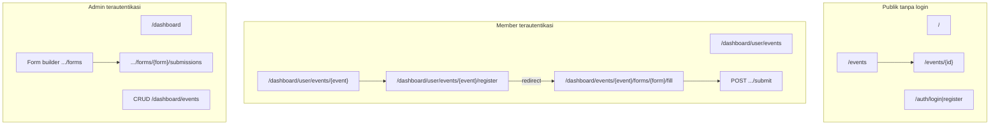

# Milestone M1–M4: sisa pekerjaan backend & alur bisnis

Dokumen ini melengkapi implementasi terbaru (Inertia/Vue): apa yang **sengaja tidak** dibuat karena **belum ada service/controller/migrasi** di backend, plus **alur web & bisnis** yang masih perlu diputuskan atau dikerjakan tim.

**Pembaruan:** bagian review registrasi dan email di bawah diselaraskan dengan kode saat ini (bukan lagi “toast saja”).

**Cara baca:** bagian “Status” memakai legenda: **Ada BE** (bisa dilanjut FE), **Perlu BE baru**, **Produk/kebijakan**.

---

## Ringkasan cepat

| Item | Status | Catatan |
|------|--------|--------|
| Lupa password (email reset) Inertia | **Perlu BE baru** | Route/controller reset Laravel standar + halaman Vue bila belum dilengkapi. |
| Review submission (Accept / Reject) | **Ada BE** | Kolom `review_status` pada `form_answers`, `PATCH` [`FormAnswerReviewController`](app/Http/Controllers/Dashboard/Events/Forms/FormAnswerReviewController.php), policy; lihat [`FormRegistrationTest`](tests/Feature/Forms/FormRegistrationTest.php). |
| Email konfirmasi / antrian | **Ada BE** | [`SendRegistrationConfirmationJob`](app/Jobs/SendRegistrationConfirmationJob.php) di-dispatch dari [`FormSubmissionController`](app/Http/Controllers/Dashboard/Events/Forms/FormSubmissionController.php) `afterCommit()`. |
| Pendaftaran tim / bundle (metadata `registration_mode`) | **Gate M4** | Anggota **diblok** untuk `team` dan `bundle` sampai M4b/M4c; admin tetap bisa buka halaman isi (pratinjau). Lihat [`FormAccessGuard`](app/Services/Form/FormAccessGuard.php). |
| Publik daftar/detail event | **Ada BE** | `EventsController` mengirim event `published` ke halaman publik. |
| Satu jalur pendaftaran member | **Ada BE** | `/dashboard/user/events/{event}/register` mengarah ke [`FormFillController`](app/Http/Controllers/Dashboard/Events/Forms/FormFillController.php) (`Fill.vue`). |

---

## Alur web (setelah perubahan)

---

## Alur bisnis yang masih “kurang” atau perlu keputusan

### 1. Persetujuan pendaftaran (Accept / Reject)

- **Status teknis:** admin dapat Accept/Reject lewat daftar submissions; status tercermin di `review_status`; pengujian otomatis di `FormRegistrationTest`.
- **Opsi produk lanjutan:** notifikasi in-app ke member saat status berubah (selain email yang sudah ada untuk jalur tertentu).

### 2. Lupa password

- **Hari ini:** login/register Inertia + OAuth (sesuai konfigurasi proyek).
- **Yang dibutuhkan bila MVP mewajibkan:** route guest `auth/forgot-password`, `auth/reset-password`, broker, halaman Vue, rate limit.

### 3. Multi-form per event

- **Hari ini:** redirect register memilih form **pertama** menurut judul; halaman fill memakai `{form}` eksplisit.
- **Keputusan produk:** jika satu event punya banyak formulir, perlu halaman “pilih form” atau tautan per form dari detail event.

### 4. Data dashboard member

- **Hari ini:** user tanpa `events.list` hanya melihat agregat dari **event published** (bukan seluruh event internal).
- **Opsi lanjutan:** KPI “Events Joined” di `Dashboard/Index.vue` — hubungkan ke query `form_answers` jika diinginkan.

---

## Perintah setelah pull (tim)

1. `composer install` — ikuti `composer.json` proyek (versi paket dapat berubah).
2. `php artisan migrate`
3. `php artisan optimize:clear`
4. `npm install && npm run build` (atau `npm run dev`).

---

## Referensi

- [docs/milestone.md](milestone.md)
- [docs/05-m4-registration.md](05-m4-registration.md)
